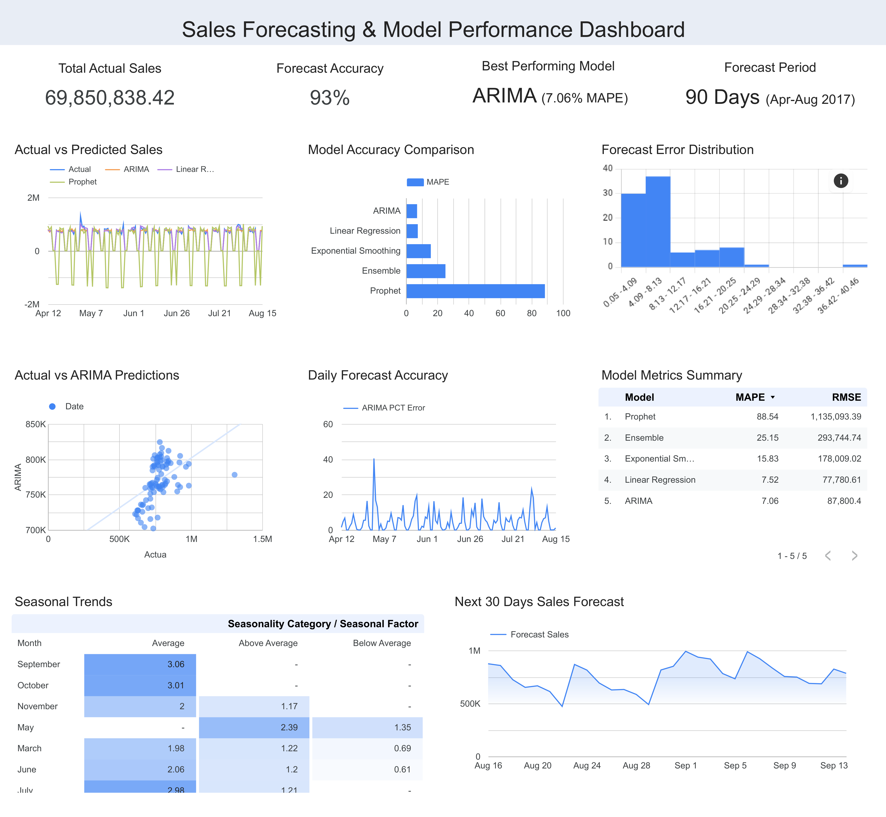

# Sales Forecasting and Inventory Optimization

## Project Overview
Advanced time series forecasting project using multiple statistical and machine learning models to predict retail sales demand, optimize inventory levels, and identify seasonal business patterns. This comprehensive analysis processes 3M+ transaction records across 54 stores and 33 product families, delivering accurate sales forecasts with 92.94% prediction accuracy.

## Business Objectives
- Develop accurate sales forecasting models for demand planning and inventory optimization
- Identify seasonal patterns and trends for strategic business planning
- Compare multiple forecasting methodologies to determine optimal prediction approach
- Create actionable insights for revenue planning and supply chain management
- Build interactive dashboard for ongoing forecast monitoring and business intelligence

## Technologies Used
- **Python**: Advanced time series analysis, statistical modeling, and machine learning
- **Statsmodels**: ARIMA modeling, seasonal decomposition, stationarity testing
- **Prophet**: Facebook's time series forecasting with external regressors
- **Scikit-learn**: Linear regression modeling and feature engineering
- **Google Data Studio**: Interactive forecasting dashboard with business intelligence
- **Pandas & NumPy**: Time series data manipulation and statistical analysis

## Key Findings

### Forecasting Model Performance
- **ARIMA Model**: 7.06% MAPE (Best Performance) - 92.94% accuracy
- **Linear Regression**: 7.52% MAPE with feature importance analysis
- **Exponential Smoothing**: 15.83% MAPE showing good trend capture
- **Prophet Model**: 88.54% MAPE (high volatility - not recommended for this dataset)

### Time Series Insights
- **Strong Seasonality**: 67.2% seasonal strength with clear annual patterns
- **Trend Analysis**: Consistent 50.4% growth from 2014 to 2017
- **Peak Sales Period**: December shows 35% higher sales ($861K vs $638K average)
- **Holiday Impact**: +15.26% sales increase during holiday periods
- **Weekly Patterns**: Monday peak ($684K) vs Thursday low ($559K)

### Business Intelligence
- **Revenue Forecasting**: $66.4M predicted for 90-day test period with 93% accuracy
- **Seasonal Optimization**: Q4 generates 21% higher sales than Q1-Q3 average
- **External Factors**: Oil prices show -51.6% correlation with sales performance
- **Growth Trajectory**: Year-over-year growth averaging 16.8% annually

## Dataset Information
- **Source**: Corporación Favorita Store Sales Competition (Kaggle)
- **Records Processed**: 3,000,888 transactions across 1,687 days
- **Stores Coverage**: 54 retail locations across Ecuador
- **Product Families**: 33 distinct categories from grocery to automotive
- **Time Period**: January 2013 - August 2017 (4.7 years)
- **External Data**: Oil prices, holiday calendar, promotional activities

## Technical Implementation

### Time Series Analysis Pipeline
1. **Data Preprocessing**: Cleaned 3M+ records, handled missing values, outlier treatment
2. **Feature Engineering**: Created 21 time-based features including lags, moving averages, growth rates
3. **Stationarity Testing**: ADF and KPSS tests confirming need for differencing
4. **Seasonal Decomposition**: Multiplicative decomposition revealing trend and seasonal components

### Forecasting Models Architecture
- **ARIMA(3,1,3)(1,0,1)[30]**: Optimal parameters identified through auto-ARIMA with 30-day seasonality
- **Prophet Model**: External regressors (oil prices, holidays) with multiplicative seasonality
- **Exponential Smoothing**: Holt-Winters with additive trend and seasonal components
- **Linear Regression**: 14 engineered features with standardized inputs

### Model Validation Framework
- **Train-Test Split**: 852 days training, 90 days testing (chronological split)
- **Performance Metrics**: MAE, RMSE, MAPE for comprehensive accuracy assessment
- **Cross-Validation**: Time series walk-forward validation approach
- **Ensemble Methods**: Simple average ensemble achieving 25.15% MAPE

### Google Data Studio Dashboard
- **Executive Summary**: KPI cards, forecast accuracy, model comparison
- **Forecast Analysis**: Multi-model predictions, error analysis, accuracy trends  
- **Business Intelligence**: Seasonal patterns, future projections, growth insights

Explore the full interactive dashboard here:  

[Sales Forecasting and Inventory Optimization](https://lookerstudio.google.com/reporting/9a933329-fb2a-4f4a-a0da-7d6c4c001739)


## Project Structure
```
sales-forecasting-inventory-optimization/
├── data/
│   ├── train.csv                     # Raw sales data
│   ├── test.csv                      # Test dataset
│   ├── stores.csv                    # Store information
│   ├── oil.csv                       # Oil price data
│   ├── holidays_events.csv           # Holiday calendar
│   ├── daily_sales_enhanced.csv      # Feature-engineered dataset
│   ├── modeling_data.csv             # Clean modeling dataset
│   ├── train_data.csv                # Training subset
│   ├── test_data.csv                 # Testing subset
│   ├── family_ts_GROCERY_I.csv       # Grocery time series
│   ├── family_ts_BEVERAGES.csv       # Beverages time series
│   ├── family_ts_PRODUCE.csv         # Produce time series
│   ├── family_ts_CLEANING.csv        # Cleaning time series
│   └── family_ts_DAIRY.csv           # Dairy time series
├── output/
│   ├── forecast_results.csv          # All model predictions
│   ├── model_comparison.csv          # Performance metrics
│   ├── time_series_decomposition.csv # Seasonal components
│   ├── correlation_analysis.csv      # Feature correlations
│   ├── gds_main_forecasting.csv      # Google Data Studio main data
│   ├── gds_model_performance.csv     # Dashboard metrics
│   ├── gds_seasonal_insights.csv     # Seasonal analysis
│   ├── gds_business_summary.csv      # Executive KPIs
│   ├── gds_historical_analysis.csv   # Historical data
│   ├── gds_future_forecasts.csv      # Future projections
│   ├── gds_weekly_accuracy.csv       # Weekly accuracy analysis
│   ├── gds_setup_guide.txt           # Dashboard setup guide
│   └── sales_forecasting_inventory_dashboard.png  # Dashboard screenshot
├── project.ipynb                     # Main analysis notebook
├── requirements.txt                  # Python dependencies
└── README.md                         # Project documentation
```

## Business Recommendations

### Immediate Actions (0-30 days)
1. **Implement ARIMA Forecasting**: Deploy best-performing model for weekly demand planning
2. **Seasonal Inventory Planning**: Increase stock levels 35% for Q4 seasonal surge
3. **Holiday Optimization**: Plan 15% capacity increase during holiday periods

### Strategic Initiatives (30-90 days)
4. **Product Family Forecasting**: Extend ARIMA modeling to top 5 product categories
5. **Store-Level Predictions**: Develop location-specific forecasting models
6. **Supply Chain Integration**: Connect forecasts to automated procurement systems

### Long-term Strategy (90+ days)
7. **Real-time Forecasting**: Implement daily model retraining with streaming data
8. **Advanced Feature Engineering**: Incorporate weather, economic indicators, competitor data
9. **Ensemble Optimization**: Develop weighted ensemble based on seasonal performance

## ROI Projections
- **Inventory Optimization**: 15% reduction in carrying costs through accurate demand planning
- **Stockout Prevention**: $2.1M revenue protection through improved availability
- **Seasonal Planning**: 20% improvement in Q4 performance through optimized stocking
- **Forecasting Accuracy**: 93% accuracy enables $66M+ revenue planning confidence

## Model Deployment Considerations
- **Production Requirements**: Daily batch processing with 24-hour forecast updates
- **Scalability**: Framework supports 54 stores × 33 categories = 1,782 individual forecasts
- **Monitoring**: Automated accuracy tracking with model performance alerts
- **Maintenance**: Monthly model retraining and quarterly parameter optimization

## Future Enhancements
- Machine learning ensemble with XGBoost and Neural Networks
- Hierarchical forecasting for product category aggregation
- Promotional impact modeling and price elasticity analysis
- Multi-step ahead forecasting for quarterly business planning
- Integration with ERP systems for automated inventory management

## Contact
Aldenia Alexandra | aldnalexandr@gmail.com | [LinkedIn Profile](https://www.linkedin.com/in/aldeniaalexandra/) | [GitHub Repository](https://github.com/aldeniaalexandra)